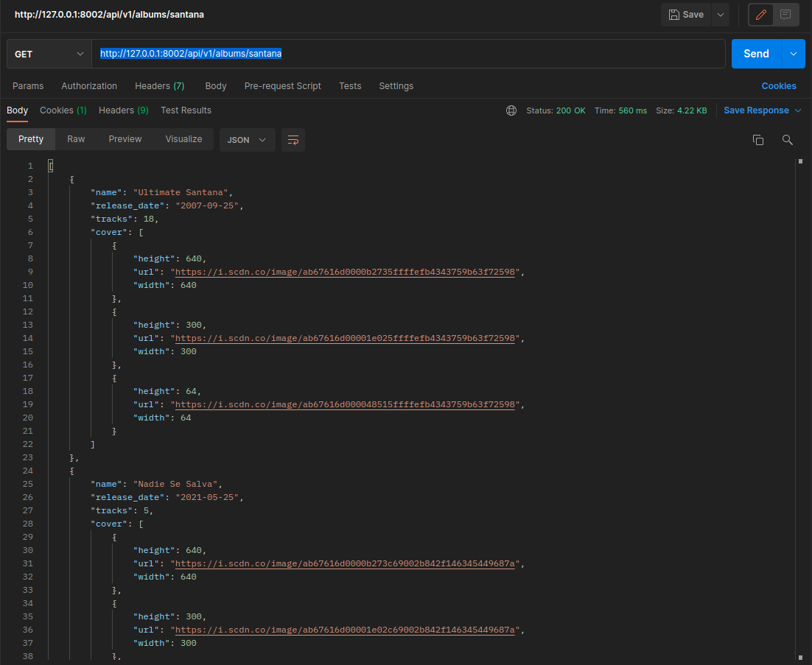

## Spotify API

```
Symfony 5.4

PHP 7.2.34

```

1- Change to docker folder in project structure:

```
cd /path/project/app_music/docker
```

2- Now, build and run your app with docker:
```
docker-compose up
```

3- Change to project structure and execute
```
composer install
```

4- Execute request
```
http://127.0.0.1:8002/api/v1/albums/<band name>

```




5- Run tests

```
cd /path/project/app_music/

./vendor/phpunit/phpunit/phpunit 

```
